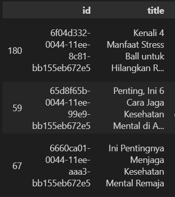

# Recommendation
* The recommendation model is in recommendation.py using tfidf and cosine similarity for text comparison.
* The dataset is in dataset folder.
* Main notebook is notebook.ipynb

## How to run the model
Here's a step-by-step command for run the model.
1. Clone the github
2. Import the library
```python
from recommendation import Recommendation
```
3. Run the Model with user input
```
from recommendation import Recommendation
person = Recommendation(DATASET_LOCATION.json,USER_INPUT)
person.recomendations()
```

* Example output if user input "saya ingin menjaga kesehatan mental saya lebih baik lagi"


